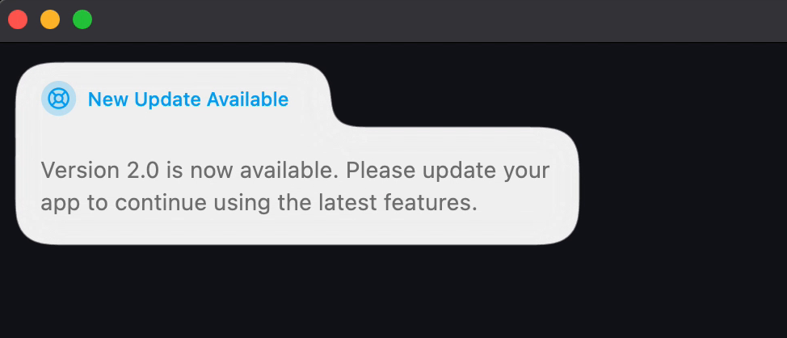

<div align="center">
  <h1>Sileo</h1>
  <p>An opinionated, physics-based toast notification for Flutter.</p>

  <p>
    <a href="https://pub.dev/packages/sileo"></a>
    <a href="https://github.com/KhaleelSH/sileo/blob/main/LICENSE"></a>
  </p>

  

  <p><b><a href="https://khaleelsh.github.io/sileo/">▶ Try the live web demo</a></b></p>
</div>

Instead of stacking cards, Sileo shows a single **liquid pill** that springs in,
morphs its width to fit its content, and grows a body out of itself, closer to a
Dynamic Island than a toast stack. It's a Flutter port of the
<a href="https://sileo.aaryan.design" target="_blank" rel="noopener noreferrer">Sileo</a>
React library from
<a href="https://x.com/hiaaryan" target="_blank" rel="noopener noreferrer">Aaryan</a>,
with zero third-party dependencies.

## Install

```yaml
dependencies:
  sileo: ^0.0.2
```

## Usage

Mount one `Toaster` (via `MaterialApp.builder`), then call `sileo.*` from anywhere:

```dart
import 'package:sileo/sileo.dart';

MaterialApp(
  builder: (context, child) => Toaster(theme: SileoTheme.system, child: child),
  home: const HomePage(),
);

// ...anywhere:
sileo.success(const SileoOptions(title: 'Saved', description: 'Your changes are live.'));
sileo.error(const SileoOptions(title: 'Upload failed'));
sileo.warning(const SileoOptions(title: 'Low storage'));
sileo.info(const SileoOptions(title: 'Heads up'));
sileo.action(SileoOptions(
  title: 'Update available',
  button: SileoButton(title: 'Restart', onPressed: restart),
));
```

Drive a notification from a future — it shows `loading`, then morphs to the result:

```dart
sileo.future<User>(
  saveProfile(form),
  SileoFutureOptions(
    loading: const SileoOptions(title: 'Saving…'),
    success: (user) => SileoOptions(title: 'Saved', description: 'Welcome, ${user.name}.'),
    error:   (e)    => SileoOptions(title: 'Failed', description: '$e'),
  ),
);
```

Dismiss or clear:

```dart
final id = sileo.info(const SileoOptions(title: 'Working…', duration: Duration.zero)); // persists
sileo.dismiss(id);
sileo.clear();
```

By default every call drives **one** notification that morphs in place. Pass an
explicit `id` to show several at once.

## Customising

- **`Toaster`**: `position`, `theme` (light/dark/system), `offset`, default `options`.
- **`SileoOptions`**: `title`, `description`, `icon`, `fill`, `roundness`, `duration`
  (omit for 6s, `Duration.zero` to persist), `autopilot`, `button`, `styles`.

See the API docs and [`example/`](example/) for a runnable demo of every feature.

## License

MIT.
